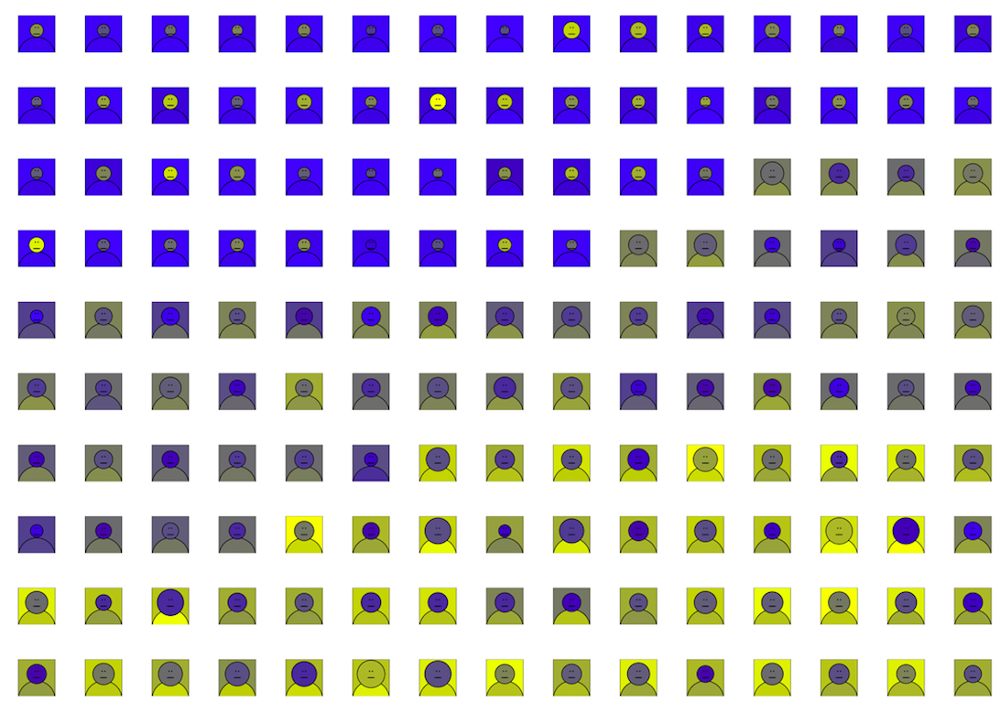

## Faces

### An R package for displaying multivariate data through a quasi-Chernoff visualization

[https://hancharik.github.io/faces/](https://hancharik.github.io/faces/)

### A visualization of the Iris dataset

 
